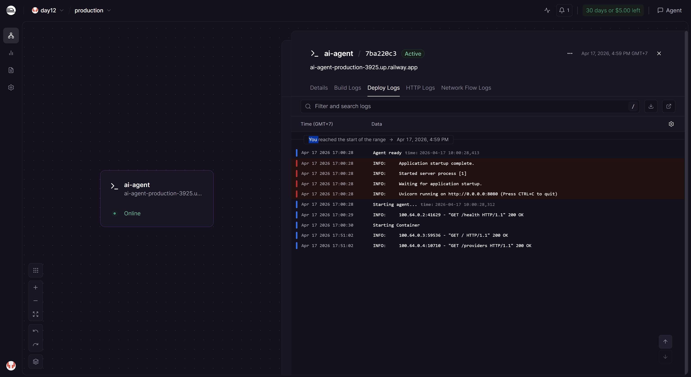
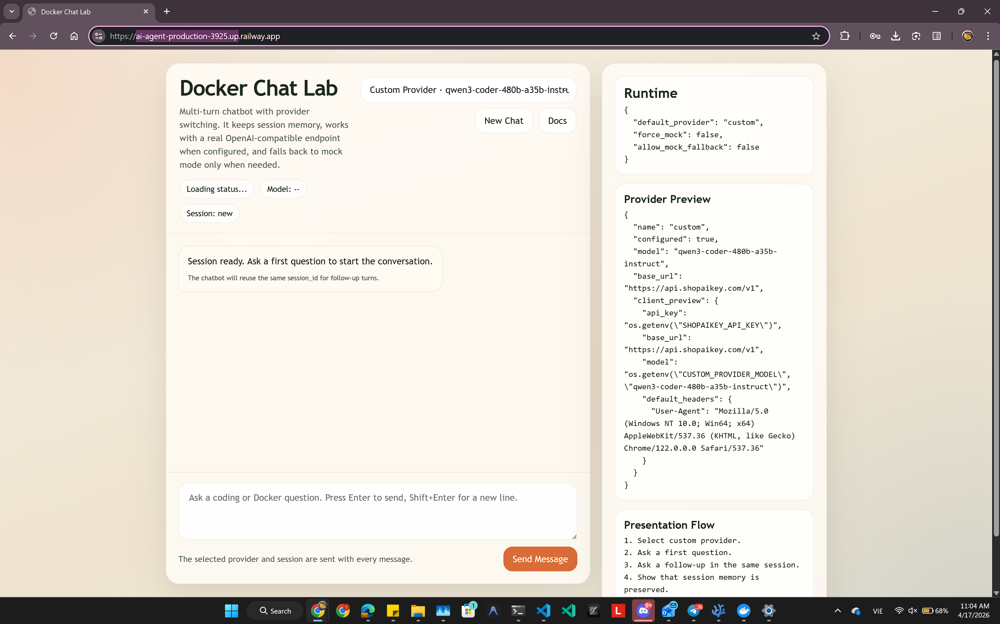
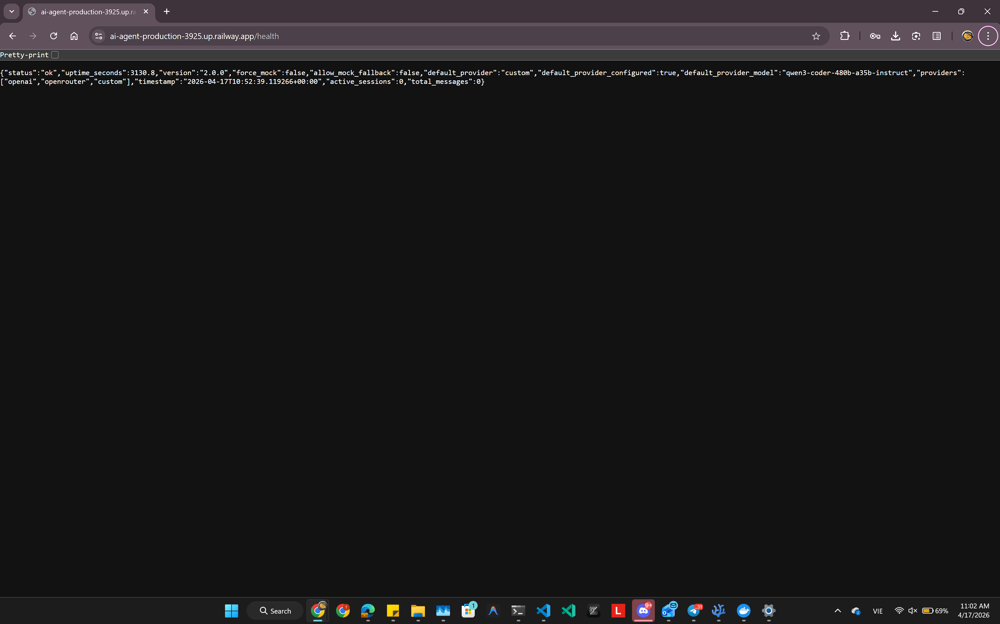

# Day 12 Lab - Mission Answers

> Student Name: Nguyen Lam Tung  
> Student ID: 2A202600173  
> Date: 2026-04-17

## Part 1: Localhost vs Production

### Exercise 1.1: Anti-patterns found
1. The develop app hardcodes secrets instead of reading them from environment variables.
2. The port and debug behavior are fixed in code, so deployment platforms cannot control runtime settings cleanly.
3. There is no health check endpoint, which makes container and cloud monitoring harder.
4. There is no readiness concept, so traffic could hit the app before dependencies are ready.
5. Shutdown is abrupt and does not explicitly handle `SIGTERM`, which risks cutting off in-flight requests.
6. Logging is ad hoc instead of structured, which makes production debugging and log aggregation harder.

### Exercise 1.2: Observation from running the basic version
The localhost version does answer requests, but it is not production-ready because it depends on local assumptions: fixed config, missing observability, and unsafe secret handling.

### Exercise 1.3: Comparison table

| Feature | Basic | Advanced | Why Important? |
|---------|-------|----------|----------------|
| Config | Hardcoded in source | Read from environment variables | Lets the same code run in dev, Docker, and cloud without edits |
| Secrets | Embedded in code | Injected at runtime | Prevents credential leaks in Git history |
| Port | Fixed `8000` | Uses `PORT` env var | Required by platforms like Railway and Render |
| Health check | Missing | `GET /health` | Lets Docker/cloud detect whether the app is alive |
| Readiness | Missing | `GET /ready` | Prevents traffic before dependencies are ready |
| Logging | `print()` style | Structured JSON logs | Easier to query and debug in production |
| Shutdown | Abrupt | Graceful signal handling | Reduces dropped requests during restarts |
| Deployment parity | Laptop only assumptions | 12-factor style | Closer dev/prod behavior means fewer surprises |

## Part 2: Docker

### Exercise 2.1: Dockerfile questions
1. Base image: the develop image uses `python:3.11`.
2. Working directory: `/app`.
3. `COPY requirements.txt` happens before copying the rest of the code so Docker can reuse the dependency layer when source files change.
4. `CMD` provides the default command when the container starts, while `ENTRYPOINT` defines the executable itself and is harder to override.

### Exercise 2.2: Basic container result
The basic Docker image packages the chatbot and shared `utils/` so the app can run consistently outside the local Python environment. It now exposes the multi-turn endpoints, provider wrapper metadata, and the browser UI at `/ui`.

### Exercise 2.3: Multi-stage build
- Stage 1 installs dependencies in a builder image.
- Stage 2 copies only the runtime artifacts into a smaller final image.
- This keeps the production image smaller and cleaner because build tools and temporary layers are not shipped.

### Exercise 2.4: Compose stack architecture
The production Docker stack uses:
- `agent`: the FastAPI chatbot app
- `redis`: shared state/cache backend
- `qdrant`: vector database service included in the lab stack
- `nginx`: reverse proxy that exposes the app cleanly

Traffic flows from client -> Nginx -> agent, while the agent can talk to Redis and Qdrant internally.

### Exercise 2.5: Image size comparison
- Develop image: measure locally with `docker images agent-develop`
- Production image: measure locally with `docker images agent-production`
- Expected result: the production image should be smaller because it uses `python:3.11-slim` and a multi-stage build

I did not hardcode exact MB values here because they depend on the machine and the last successful local build.

## Part 3: Cloud Deployment

### Exercise 3.1: Railway deployment
- Target platform: Railway
- App entrypoint: shared `cloud_app.py`, which exposes the same app used in `02-docker/production/main.py`
- Required vars for live custom provider mode:
  - `SHOPAIKEY_API_KEY`
  - `CUSTOM_PROVIDER_MODEL=qwen3-coder-480b-a35b-instruct`
  - `CHATBOT_DEFAULT_PROVIDER=custom`
  - `CHATBOT_MOCK_ONLY=false`

Public URL:
- Replace with your real domain after `railway domain`
- Example format: `https://<your-service>.up.railway.app`

GitHub Actions:
- Workflow file: `.github/workflows/railway-deploy.yml`
- Secret required: `RAILWAY_TOKEN`
- Behavior: compile smoke test first, then run `railway up --ci --service ai-agent`

### Exercise 3.2: Render deployment
`render.yaml` defines the service as infrastructure-as-code. The main difference from `railway.toml` is that Render stores more deployment configuration directly in YAML, while Railway relies more on project/service settings plus CLI operations.

### Exercise 3.3: Cloud platform comparison
Railway is the fastest path for a demo deployment, Render is still simple but a bit more configuration-oriented, and Cloud Run is stronger when you want a more explicit production platform and CI/CD pipeline.

### Deployment evidence

Railway dashboard preview:



## Part 4: API Security

### Exercise 4.1: API key authentication
The basic gateway checks `X-API-Key` through a FastAPI dependency before allowing access to `/ask`.

Expected behavior:
- Missing key -> `401`
- Wrong key -> `403`
- Valid key -> `200`

Helper script added:
- `04-api-gateway/develop/test_auth.py`

### Exercise 4.2: JWT authentication
The advanced example adds a token-issuing endpoint and protects the agent with bearer-token authentication.

JWT flow summary:
1. User posts credentials to `/auth/token`
2. Server returns a signed JWT
3. Client sends `Authorization: Bearer <token>`
4. Protected endpoints verify the token before processing the request

### Exercise 4.3: Rate limiting
The advanced example uses a sliding-window style limiter with separate limits by role.

Observed/expected behavior from the implementation:
- Normal user limit is lower than admin limit
- Repeated rapid requests eventually return `429`

Helper script added:
- `04-api-gateway/production/test_advanced.py`

### Exercise 4.4: Cost guard implementation
My approach is to keep a usage record per period, estimate cost from input/output token counts, and block new requests once the budget threshold is reached.

Implementation notes:
- In the advanced security demo, cost guard is applied before serving the request.
- In the final app, the budget is configured with `MONTHLY_BUDGET_USD=10.0`.
- For a larger multi-instance production system, the same logic should be stored in Redis or another shared datastore, similar to session storage.

## Part 5: Scaling & Reliability

### Exercise 5.1: Health and readiness
I implemented and documented:
- `GET /health` for liveness
- `GET /ready` for dependency readiness

These endpoints are used both in the scaling demo and in the final production app.

### Exercise 5.2: Graceful shutdown
The reliability examples register signal handlers for `SIGTERM`/`SIGINT` so the process can stop cleanly and log shutdown activity instead of exiting abruptly.

### Exercise 5.3: Stateless design
The production scaling demo moves conversation state out of process memory and into Redis so multiple agent instances can serve the same session safely.

### Exercise 5.4: Load balancing
The scaling demo uses:
- multiple `agent` replicas
- Nginx as the load balancer
- Redis as shared state

This allows requests to land on different containers while keeping the conversation intact.

### Exercise 5.5: Stateless test
Provided artifacts:
- `05-scaling-reliability/production/test_stateless.py`
- `05-scaling-reliability/production/docker-compose.yml`
- `05-scaling-reliability/production/Dockerfile`
- `05-scaling-reliability/README.md`

The key result is that `served_by` can change across requests, but session context still survives because it is stored outside the app process.

## Part 6: Final Project Summary

### Final app delivered in `06-lab-complete`
The complete final app combines:
- API key authentication
- Rate limiting (`10 req/min`)
- Cost guard (`$10/month`)
- Multi-turn chat with session history
- Redis-backed stateless session storage
- Structured logging
- Graceful shutdown
- Docker and Compose deployment
- Railway and Render deployment configs
- Browser UI at `/ui`
- Provider wrapper for `openai`, `openrouter`, and `custom`

Final app UI preview:



### Live provider wrapper
The custom provider uses the OpenAI-compatible client shape:

```python
client = OpenAI(
    api_key=os.getenv("SHOPAIKEY_API_KEY"),
    base_url="https://api.shopaikey.com/v1",
    default_headers={
        "User-Agent": "Mozilla/5.0 (Windows NT 10.0; Win64; x64) "
        "AppleWebKit/537.36 (KHTML, like Gecko) "
        "Chrome/122.0.0.0 Safari/537.36"
    },
)
```

Default live model:
- `qwen3-coder-480b-a35b-instruct`

### Verification completed locally
- `python -m compileall 04-api-gateway 05-scaling-reliability 06-lab-complete`
- `python 06-lab-complete/check_production_ready.py`

The production-readiness checker for Part 6 passed at `100%` in the local repository state.

Health check preview:


